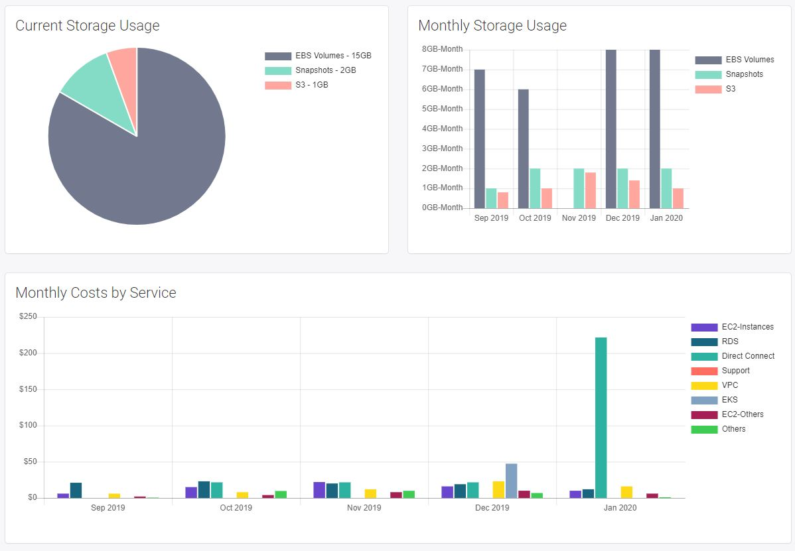

AWS Dashboard
------------------

This application shows the current and historical storage usage (EBS, snapshots and S3) in your AWS infrastructure. It also shows your AWS costs by services over time. 

 The application was built with [Django](https://www.djangoproject.com/) and uses the libraries [Charj](https://www.chartjs.org/) to generate the graphs and [boto3](https://boto3.amazonaws.com/v1/documentation/api/latest/index.html) to connect to AWS Cost Explorer. 
 
 Before running the application, please go to the file [aws.py](app_code/dashboard/lib/aws.py) and write the AWS credentials required to connect to AWS Cost Explorer API. 
 ```
 self.session = boto3.session.Session(
            aws_access_key_id='',
            aws_secret_access_key='',
            region_name='us-east-1'
        )
 ```
 
Please notice that if you are going to run the application in AWS you should follow AWS best practices and assign an IAM role to the instance where the application will be running. 
That way, you do not need to have the aws keys in your code.

 You can use the following policy for the IAM role
 
 ```
 {
    "Version": "2012-10-17",
    "Statement": [
        {
            "Sid": "VisualEditor0",
            "Effect": "Allow",
            "Action": [
                "ce:DescribeCostCategoryDefinition",
                "ce:GetRightsizingRecommendation",
                "ce:GetCostAndUsage",
                "ce:GetSavingsPlansUtilization",
                "ce:GetReservationPurchaseRecommendation",
                "ce:ListCostCategoryDefinitions",
                "ce:GetCostForecast",
                "ce:GetReservationUtilization",
                "ce:GetSavingsPlansPurchaseRecommendation",
                "ce:GetDimensionValues",
                "ce:GetSavingsPlansUtilizationDetails",
                "ce:GetCostAndUsageWithResources",
                "ce:GetReservationCoverage",
                "ce:GetSavingsPlansCoverage",
                "ce:GetTags",
                "ce:GetUsageForecast"
            ],
            "Resource": "*"
        }
    ]
}
 ```
 
 

